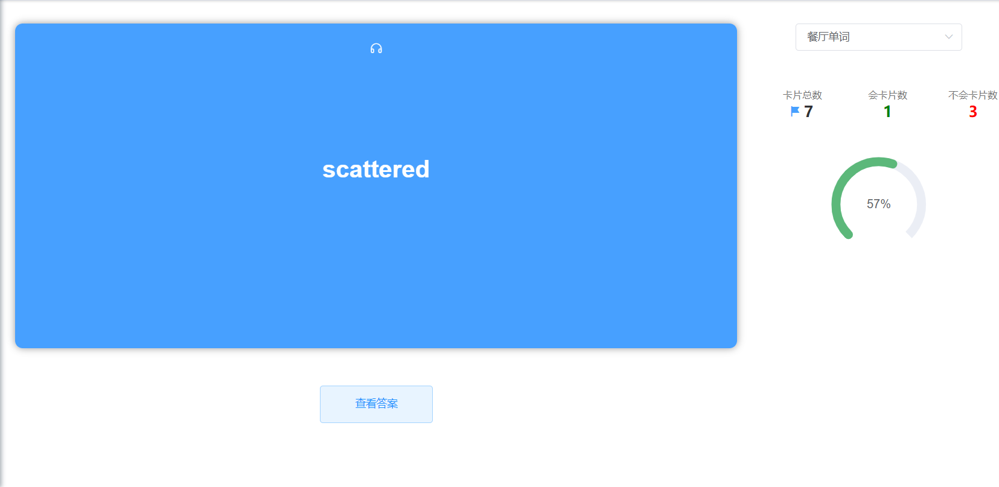
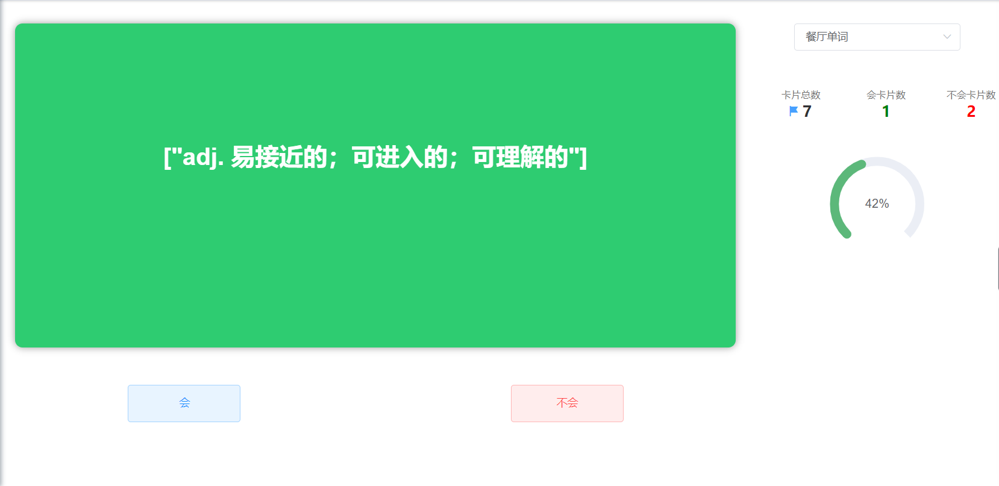
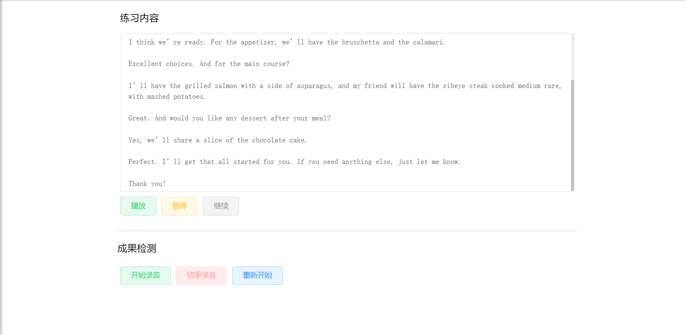

# 为什么要做这个项目
英语的学习不只是有背单词，还要积累常用表达，更重要的是多听多说。在记单词时，如果只是机械的的记忆某个单词本身或单词的含义，那学习的效果将大打折扣，因为学习需要关联，通过关联形成网状的知识结构，才是抵抗遗忘的最好方式。有时想使用英语表达自己的某个想法或意见时，可能从最开始的无法开口表达，在通过不断学习和积累后，能勉强达到意思再到最后地道的表达，因此记录常用的日常表达也是很重要的。如果希望快速的了解某些特定场景下的对话表达，再去花60%的时间进行搜索和记录，40%或者更少的时间学习，效率显然不是最佳的。本项目旨在开发一个高效易用的英语学习工具，希望给学习英语的小伙伴提供一点灵感和帮助，学习需要日积月累，坚持其实才是最难的。
# 项目介绍
plt是一个基于若依搭建的个人学习工具，参考了日常的学习过程和使用习惯，目标是方便学习和记录从形成自己的知识体系。
## 技术介绍
这是个前后端分离的项目
### 前端
* 主框架：Vue2
* 构建工具：Webpack5
* UI组件：Element UI
* 富文本组件：CKEditor5
* 网页语音API：SpeechSynthesis
### 后端
* Java版本：JDK 8
* Spring框架：SpringBoot 2.5.15
* 安全框架：Spring Security
* 数据库：Mysql
* 分布式缓存：Redis
* ORM框架：MyBatis-Plus
* 权限认证使用Jwt
## 功能介绍
1. 首页：词库数量统计、单词数量统计、学习情况统计
2. 词汇管理：包含词库管理、单词管理、单词集管理、我的单词、单词搜索
3. 闪卡管理：包含卡包管理、闪卡管理、学习闪卡
4. 笔记管理：新增笔记、修改笔记、笔记查看
5. 场景管理：支持自定义不同场景的会话，会话学习
6. 表达管理：记录常用表达，支持修改和查看历史，可以更完整的记录整个学习成才的过程
## 演示图
### 学习卡片
卡片正面

卡片反面

听说练习
